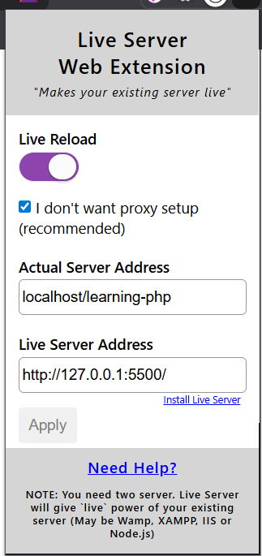

# Learning PHP

PHP is a **server-side scripting language**, which means it **cannot run directly in a browser** like HTML or JavaScript. To run PHP code, you need:

1. **Web server**
2. **PHP**
3. **Database (MySQL)**

The easiest way to get all three is by installing **XAMPP**.

Download XAMPP here: [https://www.apachefriends.org](https://www.apachefriends.org)

---

## Step 1: Install and Set Up XAMPP

1. Install XAMPP.
2. Open XAMPP and **start Apache** and **MySQL**. You can close the control panel afterward; the servers will continue running in the background.
3. Navigate to the installation folder (usually `C:\xampp`).
4. Open the `htdocs` folder inside XAMPP. This is where all your PHP projects will be stored.
5. Create a new folder for your project, e.g., `learning-php`.
6. Open this folder in **VSCode**.
7. Create a PHP file, e.g., `index.php`.
8. Open your browser and navigate to:  
   Example: `http://localhost/learning-php`

> 💡 **Tip:** Always keep your project inside `htdocs` to avoid server errors.

---

## Step 2: Install VSCode Extensions for PHP

To make PHP development easier, install these extensions in VSCode:

- **PHP Intelephense** – intelligent code completion and error checking.
- **PHP Server** – run PHP scripts directly from VSCode.
- **Live Server** – automatically refreshes your browser when you make changes.

---

## Step 3: Set Up Live Server for PHP

1. Install **Live Server** in your browser from the [Chrome Web Store](https://chrome.google.com/webstore).  
 
   

2. Open Live Server settings in VSCode:  
 
   

3. Configure the settings:

- **Actual Server Address:** Your PHP server URL (e.g., `http://localhost/learning-php`)
- **Live Server Address:** Leave as default or enter the same URL.

4. Start Live Server in VSCode by clicking **Go Live**.
5. Copy the provided URL and paste it in your browser to view your PHP project live.

---

✅ Now you are ready to write and run PHP code on your local machine!
